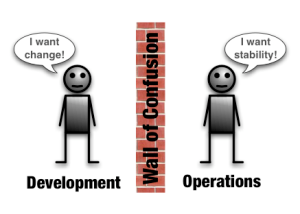
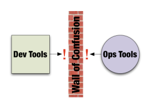
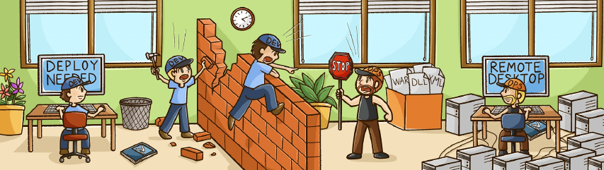
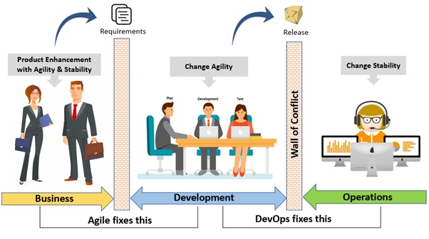
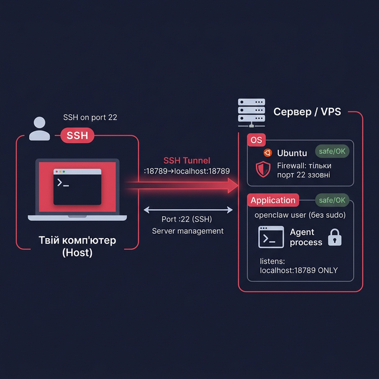

# Тема 0: Навіщо це все? Філософія та принципи DevOps — Теорія

> **Файл для викладача.** Детальний конспект для підготовки до заняття.
> Парний файл: `00_DevOps_Philosophy_Lab.md` (лабораторна робота)

---

## 🎯 Бізнес-задача

Ми з вами будемо весь семестр будувати інфраструктуру для AI-асистента. Але перед тим, як торкатися будь-якого інструменту, давайте поставимо просте питання: **хто відповідає за те, щоб цей асистент працював o 3 годині ночі, коли розробник спить?**

Ще одне питання: якщо розробник написав нову функцію, скільки часу пройде до того, як нею зможе скористатися кінцевий користувач? День? Тиждень? Місяць? Чому взагалі між написанням коду та його появою в продакшені є якась прірва?

Саме ці питання і є точкою входу в DevOps.

**Зв'язок з проєктом:** У нашому проєкті `My_AI_Assistant` є дві ролі: розробник, який пише код агента, і хтось (або щось), хто гарантує, що цей агент запущений, оновлений та доступний. DevOps — це про те, щоб ці ролі не воювали між собою, а злилися в один злагоджений процес.

---

## 🎭 Метафора заняття: Ефект Червоної Королеви

### Метафора DevOps: Ефект Червоної Королеви

> "Well, in our country," said Alice, still panting a little, "you'd generally get to somewhere else — if you ran very fast for a long time, as we've been doing."
>
> "A slow sort of country!" said the Queen. "**Now, here, you see, it takes all the running you can do, to keep in the same place.** If you want to get somewhere else, you must run at least **twice as fast as that!**"
>
> — *Lewis Carroll, «Through the Looking-Glass»*

---

> «Ну, у нас, — сказала Аліса, все ще трохи важко дихаючи, — зазвичай потрапляєш в інше місце, якщо бігти дуже швидко і довго, як ми щойно робили».
>
> «Яка повільна країна! — вигукнула Королева. — **Тут, як бачиш, треба бігти щосили, щоб тільки залишитися на одному місці.** А якщо хочеш потрапити в інше місце, треба бігти принаймні **вдвічі швидше!**»
>
> — *Льюїс Керролл, «Аліса в Зазеркаллі» (1871)*

---

У романі Аліса дивується: вони бігли що є сили, але залишились на тому самому місці. Червона Королева пояснює: у Зазеркаллі **нерухомість вимагає максимальних зусиль**, а для реального руху вперед потрібно **подвоїти швидкість**.

Цей фрагмент ліг в основу **«Гіпотези Червоної Королеви»** — концепції з біології та економіки, яка стверджує: щоб просто *зберігати поточну позицію* в конкурентному середовищі, потрібно постійно розвиватися та адаптуватися.

**Чому це про DevOps?** Програмне забезпечення існує у середовищі, що постійно змінюється:

- Операційні системи оновлюються, старі залежності застарівають.
- З'являються нові вразливості безпеки.
- Конкуренти випускають нові функції.
- Вимоги користувачів ростуть.

Команда, яка «стоїть на місці» і не автоматизує, не вимірює, не вдосконалює свої процеси — насправді **рухається назад** відносно індустрії. DevOps — це відповідь на виклик Червоної Королеви.

**Ключові поняття:**

- **Red Queen Hypothesis (Гіпотеза Червоної Королеви)** — необхідність постійної адаптації, щоб зберегти конкурентну позицію.

---

## 🧠 Необхідні знання

### 1. Стіна між Dev та Ops — звідки взялася проблема?

 

Уявіть типову компанію початку 2000-х. Є дві команди:

- **Розробники (Dev)** — пишуть код, додають нові функції. Їхня мета: якомога швидше випускати зміни. Вони вимірюють успіх тим, скільки фіч зроблено.
- **Системні адміністратори (Ops)** — підтримують стабільність серверів. Їхня мета: щоб нічого не падало. Вони вимірюють успіх тим, що нічого *не змінилося*.

Ці дві команди мали **протилежні стимули**. Розробники хотіли змін, адміністратори боялися змін. Між ними виникла так звана «Стіна» (Wall of Confusion): розробники "перекидали" код через стіну в Ops, а Ops "перекидали" назад баг-репорти.

Результат: релізи відбувалися раз на кілька місяців, кожен реліз перетворювався на подію (часто — у стрес), а відповідальність ніхто не хотів брати на себе.



**Ключові поняття:**

- **Dev (Development)** — команда, що розробляє програмне забезпечення
- **Ops (Operations)** — команда, що підтримує роботу інфраструктури та сервісів
- **Wall of Confusion** — культурна та процесна прірва між Dev та Ops

---

### 2. Що таке DevOps?

DevOps — це **культура, набір практик та підхід до організації роботи**, мета якого — зламати «Стіну» між Dev та Ops, щоб якісне програмне забезпечення потрапляло до кінцевого користувача **швидко, безпечно та передбачувано**.

> ⚠️ Важливо: DevOps — це **НЕ** посада, **НЕ** набір інструментів і **НЕ** відділ в компанії. Це спосіб мислення і взаємодії команд. Інструменти (Ansible, Docker, GitLab CI) — лише засоби для реалізації цього підходу.

DevOps народився приблизно в 2008–2009 роках. Ключовими джерелами стали доповідь Patric Debois та книга «The Phoenix Project» (2013), яка стала "Біблією DevOps".



**Ключові поняття:**

- **DevOps** — культура та набір практик для об'єднання розробки та експлуатації
- **«The Phoenix Project»** — культова книга, що пояснює DevOps через художню розповідь

---

### 3. Модель CALMS — п'ять стовпів DevOps

CALMS — це акронім, що описує п'ять принципів, на яких тримається DevOps-культура:

- **C — Culture (Культура):** Люди та взаємодія важливіші за процеси та інструменти. Без зміни культури жоден інструмент не допоможе. Команди спільно несуть відповідальність за продукт від написання коду до роботи в продакшені.
- **A — Automation (Автоматизація):** Все, що можна автоматизувати — потрібно автоматизувати. Ручна робота — джерело помилок та уповільнень. Тестування, деплоймент, налаштування серверів — все це описується у вигляді коду.
- **L — Lean (Ощадність):** Усуваємо все, що не приносить цінності. Маленькі часті зміни краще, ніж рідкісні великі релізи. Мінімізуємо незавершену роботу (Work In Progress).
- **M — Measurement (Вимірювання):** Неможливо покращити те, що не вимірюєш. Ми відстежуємо ключові метрики: час від коміту до продакшену, кількість інцидентів, час відновлення після збою.
- **S — Sharing (Обмін знаннями):** Команди відкрито діляться знаннями, інструментами, невдачами та успіхами. Культура blame-free (без пошуку винних) дозволяє вчитися на помилках.

**Ключові поняття:**

- **CALMS** — Culture, Automation, Lean, Measurement, Sharing
- **Blame-free culture** — культура, де помилки розглядаються як можливість для навчання, а не привід для покарання

---

### 4. Три шляхи DevOps

«Три шляхи» — це ще більш узагальнений фреймворк з книги «The DevOps Handbook»:

- **Перший шлях — Flow (Потік):** Прискорюємо потік роботи від розробника до кінцевого користувача. Усуваємо вузькі місця на шляху від коміту до продакшену.
- **Другий шлях — Feedback (Зворотний зв'язок):** Прискорюємо і посилюємо зворотний зв'язок: від продакшену назад до розробника. Моніторинг, алерти, автоматичне тестування — все це форми feedback loop.
- **Третій шлях — Continual Learning (Безперервне навчання):** Культура експериментів, навчання на помилках і постійного вдосконалення.

**Ключові поняття:**

- **Flow** — швидкість та безперервність потоку від Dev до Prod
- **Feedback loop** — механізм зворотного зв'язку між Prod і розробниками
- **Continual Learning** — культура безперервного навчання і покращення

---

### 5. Ключові метрики DevOps (DORA)

Дослідницька група DORA (DevOps Research and Assessment) виявила 4 ключові метрики, що відрізняють "елітні" DevOps-команди від середніх:

| Метрика                    | Що вимірює                                                                   | «Еліта» (Performance)          |
| --------------------------------- | ------------------------------------------------------------------------------------- | ------------------------------------- |
| **Deployment Frequency**    | Як часто виходять релізи у Production                           | Кілька разів на день |
| **Lead Time for Changes**   | Час від першого коміту до роботи на продакшені | Менше 1 години             |
| **Change Failure Rate**     | % змін, що потребують відкату або хотфіксу          | < 15% (для еліти < 5%)        |
| **Time to Restore Service** | Час відновлення після інциденту                           | Менше 1 години             |

#### Детальніше про кожну метрику та приклади

1. **Deployment Frequency (Частота розгортання)**

   - **Суть:** Наскільки маленькими порціями ми видаємо цінність користувачу?
   - **Приклад:** Якщо ми чекаємо місяць, щоб накопичити 50 фіч і випустити їх разом — це низька частота. Якщо кожна виправлена кома або нова кнопка деплоїться одразу після перевірки — це висока частота.
2. **Lead Time for Changes (Час виконання змін)**

   - **Суть:** Скільки часу розробник «чекає», поки його код побачить світ?
   - **Приклад:** Я написав зміну о 10:00. Вона пройшла тести, перевірки та розгорнулася об 11:30. Lead Time = 1.5 години. Якщо код лежить у черзі на деплой два тижні — це поганий показник.
3. **Change Failure Rate (Відсоток невдалих змін)**

   - **Суть:** Це головний показник стабільності. Важливо розуміти, що **невдачею (Failure)** вважається не просто будь-який баг, а лише той, що потребував негайного втручання.
   - **Що вважається невдачею:**
     - **Rollback:** Нам довелося терміново повернути попередню версію коду, бо нова все зламала.
     - **Hotfix:** Нам довелося «гасити пожежу» і випускати виправлення протягом лічених хвилин, бо сервіс недоступний або критично пошкоджений.
   - **Приклад:** Ми зробили 10 оновлень. Після одного з них бот перестав відповідати, і ми зробили rollback. Наш CFR = 10%.
4. **Time to Restore Service (Час відновлення)**

   - **Суть:** Якщо сталась аварія (а вони стаються у всіх), як швидко ми можемо «піднятися»?
   - **Приклад:** Сервер «ліг» о 14:00. Завдяки автоматизації та бекапам ми підняли його о 14:15. Час відновлення — 15 хв. Якщо адмін три дні шукає, де лежить бекап — це «низький» рівень DevOps.

**Ключові поняття:**

- **DORA** — DevOps Research and Assessment, дослідницька група Google, що вивчає ефективність IT-команд.
- **Failure (у контексті CFR)** — критичний збій, що потребує миттєвої реакції (відкат або хотфікс).

---

### 6. Шлях коду: Життєвий цикл розробки (SDLC) та потік робіт

DevOps неможливо зрозуміти у відриві від **Software Development Life Cycle (SDLC)**. Це не просто перелік термінів, а **безперервний потік**, де на кожному етапі залучені різні люди та процеси.

Якщо ці кроки не узгоджені, а команди Dev та Ops не мають спільної культури, потік зупиняється, виникають конфлікти та збої.

#### Схема Pipeline: від ідеї до користувача

```text
 РОЗРОБНИК (DEV)  GIT (VCS)    I/CD (AUTO)    STAGING (QA)  PRODUCTION (OPS)
     │              │               │              │            │
  пише код  ──► commit/push ──► авто-тести ──► перевірка ──► випуск
                               збірка (build)   вручну або    для всіх
                                                 авто         користувачів
```

Кожна стрілка на цій схемі — це точка потенційного конфлікту або, навпаки, точка автоматизації:

- **Step 1: Code & Commit.** Розробник пише код і фіксує його в **Git**. На цьому етапі важливо, щоб документація (Docs as Code) створювалася паралельно.
- **Step 2: Build & Test (CI).** Щойно код потрапляє в репозиторій, автоматика (Continuous Integration) збирає його та перевіряє. Тут «Стіна» починає руйнуватися: розробник отримує миттєвий feedback, чи працює його код з іншими частинами системи.
- **Step 3: Staging (Environment).** Це «генеральна репетиція». Код розгортається в середовищі, що максимально нагадує робоче. Тут виявляються проблеми з конфігурацією, які раніше помітили б лише в ніч релізу.
- **Step 4: Deployment & Release (CD).** Вихід у «світ». У DevOps-культурі це не героїчний вчинок, а рутинна автоматизована операція.
- **Step 5: Feedback & Rollback.** Якщо щось пішло не так, система дозволяє миттєво відкотитися назад. Це забезпечує стабільність без втрати швидкості.

#### 📖 Ключові терміни SDLC

| Термін                          | Коротке визначення                                                                                                     |
| ------------------------------------- | --------------------------------------------------------------------------------------------------------------------------------------- |
| **VCS (Git)**                   | Система контролю версій — «машина часу» для коду та конфігурацій.                |
| **CI (Continuous Integration)** | Автоматична перевірка коду програмою одразу після його завантаження в Git. |
| **CD (Continuous Deployment)**  | Автоматичне розгортання перевіреного коду на сервери.                                    |
| **Pipeline**                    | Ланцюжок кроків, які проходить код від розробника до користувача.                |
| **Deployment**                  | Процес встановлення та запуску нової версії програми на сервері.                 |
| **Environment**                 | Оточення (сервер), де працює код (напр. Staging — для тестів, Production — для людей).  |
| **Hotfix / Rollback**           | Термінове виправлення бага / відкат до версії, що працювала раніше.              |

> 💡 **Головна проблема SDLC без DevOps:** розробник бачить лише крок 1, а оператор (Ops) — лише кроки 4 та 5. DevOps об'єднує цей потік, роблячи його спільним завданням.

---

### 7. Як DevOps виглядає в нашому проєкті

#### 7.1 Структура репозиторію — «все в одному місці»

У репозиторії `My_AI_Assistant` код і конфігурації живуть поруч:

```text
My_AI_Assistant/ репозиторій
├── 01_Architecture/      ← Архітектура описана в коді (Docs as Code)
├── DevOps/               ← Матеріали курсу
│   └── devops-ai-assistant/
│       ├── 10_Implementation/
│       │   ├── ansible/  ← IaC: автоматичне налаштування сервера
│       │   └── terraform/← Provisioning: створення VPS одним файлом
│       └── 01_Architecture/← Схеми та опис системи
```

**Що це означає на практиці:**

- **Infrastructure as Code (IaC)** — конфігурація сервера зберігається у файлах Ansible (`playbook.yml`), а не «зроблена вручну і забута». Якщо сервер зламається, нова машина налаштується за лічені хвилини запуском одного скрипту.
- **Docs as Code** — документація (`01_Architecture/`) зберігається в Git поруч з кодом, версіонується і завжди відповідає реальному стану системи.
- **Single Source of Truth** — один репозиторій є єдиним джерелом правди. Немає плутанини «яка версія правильна?».

**Ключові поняття:**

- **Infrastructure as Code (IaC)** — підхід, при якому інфраструктура описується у вигляді коду (файлів конфігурації), а не налаштовується вручну.
- **Docs as Code** — документація зберігається і версіонується так само, як і код програми.
- **Single Source of Truth** — єдиний авторитетний джерело актуальної інформації про стан системи.

#### 6.2 Ізоляція та безпека — принцип найменших привілеїв

Агент `openclaw` у нашому проєкті розгорнутий з максимальною безпекою. Розглянемо кожен шар захисту:

**🛡 Firewall (Фаєрвол):** Зовні сервер приймає підключення **лише на порт `22` (SSH)**. Всі інші порти закриті. Зловмисник з інтернету не зможе напряму потрапити до агента.

**👤 Окремий системний користувач `openclaw` без `sudo`:** Агент запускається не від імені `root` або адміністратора, а від імені спеціального обмеженого користувача. Навіть якщо зловмисник якимось чином зламає процес агента, він опиниться в «пісочниці» без прав на решту системи.

- **Principle of Least Privilege (Принцип найменших привілеїв)** — кожен процес і користувач повинні мати рівно стільки прав, скільки потрібно для виконання своєї задачі — і ні на біт більше. Це один з фундаментальних принципів безпеки.

**🔒 Агент слухає лише `localhost:18789`, а не `0.0.0.0`:** Це критична деталь. `0.0.0.0` означає «слухати на всіх мережевих інтерфейсах», тобто агент був би доступний з будь-якої IP-адреси. `localhost` (він же `127.0.0.1`) — це «петля», доступна лише з самого сервера зсередини. Так UI агента фізично недоступний з інтернету.

**🚇 Доступ через SSH-тунель:** Щоб підключитися до UI агента зі свого комп'ютера, ми налаштовуємо SSH-тунель:

```bash
ssh -L 18789:localhost:18789 user@server-ip
```

Ця команда каже: «все, що надходить на мій локальний порт `18789`, надсилай зашифрованим SSH-каналом на `localhost:18789` сервера». Ми бачимо UI агента у своєму браузері, але сполучення завжди зашифроване і проходить лише через SSH.



**Ключові поняття:**

- **Firewall** — програмна чи апаратна система, що фільтрує мережеві пакети за заданими правилами (дозволяє або блокує підключення).
- **Principle of Least Privilege** — принцип безпеки: мінімум прав, необхідних для виконання задачі.
- **localhost / 127.0.0.1** — спеціальна петлева адреса, доступна лише зсередини самого комп'ютера/сервера.
- **SSH-тунель** — зашифрований канал зв'язку, що дозволяє безпечно передавати трафік від локального порту до порту на віддаленому сервері.
- **0.0.0.0** — спеціальна адреса, що означає «всі мережеві інтерфейси» — протилежність `localhost`.

---

> 💡 **Запам'ятайте головне правило:** ніколи не тестуйте на Production. Для цього існує Staging.

---

## ❓ Питання для обговорення на занятті

1. Які проблеми виникали б, якби розробник і адміністратор завжди переслідували протилежні цілі? Що більше постраждає — надійність чи швидкість?
2. Чому DevOps — це в першу чергу культура, а не набір інструментів? Чи може компанія "впровадити DevOps", просто встановивши Jenkins чи GitLab?
3. Як ви думаєте, яка з 4 DORA-метрик є найважливішою? Чому?
4. Де в нашому проєкті `My_AI_Assistant` ви вбачаєте реалізацію принципів CALMS?

---

## 🔗 Що далі

Ми зрозуміли *чому* DevOps існує і *що* він пропонує. Тепер час взятися за першу конкретну задачу: нам потрібне безпечне, ізольоване середовище, де ми зможемо практикувати всі ці принципи, не ризикуючи зламати робочий комп'ютер. Це і є тема **Теми 1: Створення Dev Environment**.
